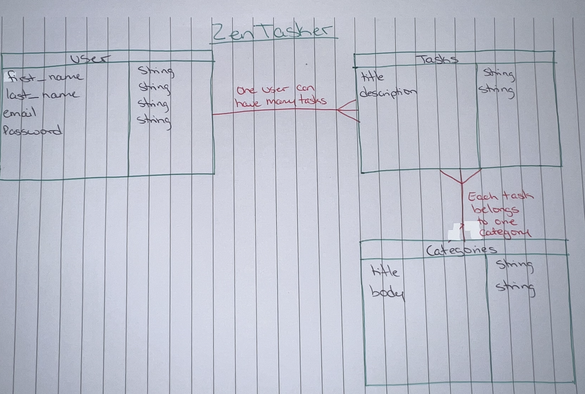

# ZenTasker

This is the backend for the full stack To-Do app for my ZenTasker.

## Planning section

2 parts associated with planning our API(the backend)
- ERD
- User Stories

#### User Stories

AAU I want to...
- Create users
- Sign in users
- Sign out users
- Change password
- Create tasks
- See a list of all tasks
- See a list of MY tasks
- See a single task
- Edit a task
- Delete a task
- Add task completion


# Screenshot


# Technologies Used

- React 
- Bootstrap
- CSS
- JavaScript
- Express
- Mongoose
- MongoDB
- Jwt


### Authentication

| Verb   | URI Pattern            | Controller#Action |
|--------|------------------------|-------------------|
| POST   | `/sign-up`             | `users#signup`    |
| POST   | `/sign-in`             | `users#signin`    |
| PATCH  | `/change-password/` | `users#changepw`  |
| DELETE | `/sign-out/`        | `users#signout`   |
| GET    | `/user/<user_id>`        | `users#tasks`   |


#### TASKS

| Verb   | URI Pattern            | Controller#Action |
|--------|------------------------|-------------------|
| GET   | `/tasks`              | `tasks#index`    |
| GET   | `/tasks/<task_id>`    | `tasks#details`     |
| POST   | `/tasks`             | `tasks#create`   |
| PATCH  | `/tasks/<task_id>` | `tasks#update`   |
| DELETE | `/tasks/<task_id>` | `tasks#delete`   |


#### Recommended Request bodies 

Request - users#signup:

```json
{
    
      "email": "an@task.email",
      "password": "an task password",
      "password_confirmation": "an task password"
    
}
```


Request - tasks#create (requires a token):

```json
{
    "task": {
        "category": "Stress Relief Tasks",
        "title": "Yoga Session",
        "description": "Engage in a 20-minute yoga session focusing on poses that promote relaxation.",
        "complete": true
    }
}
```


### Token Auth Strategy

Send the token as `Bearer Token <token>`


### ERD

